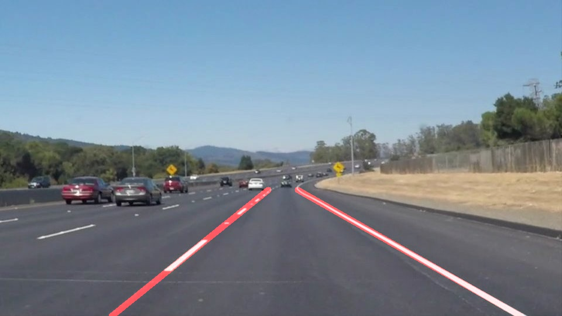
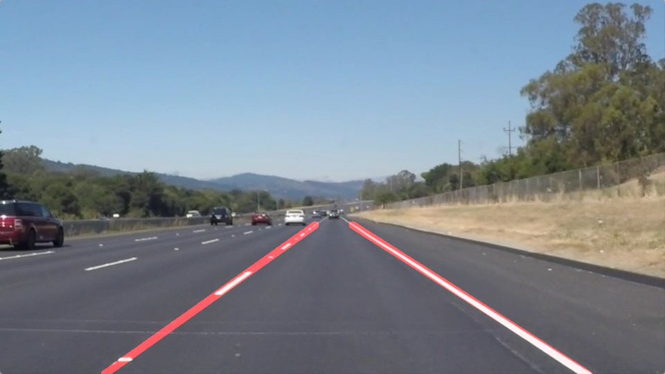
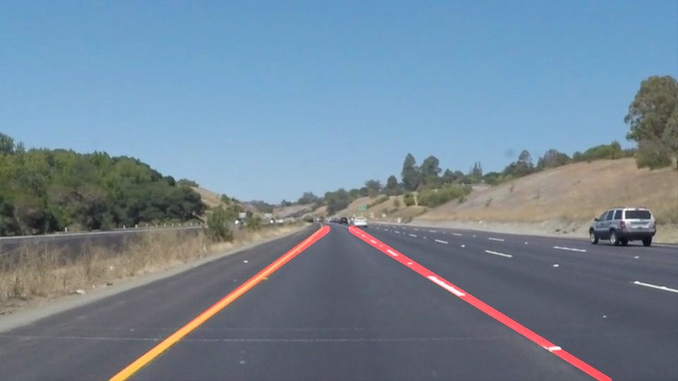
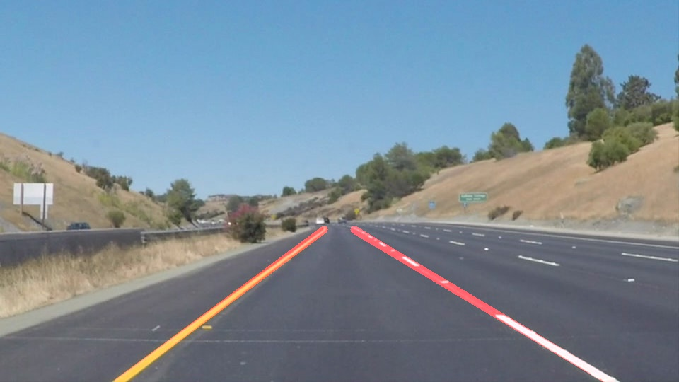
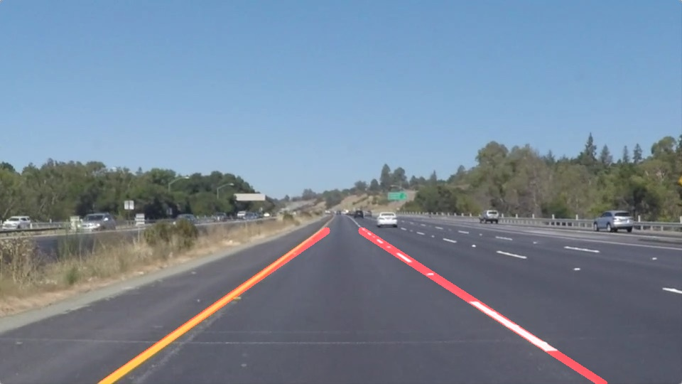
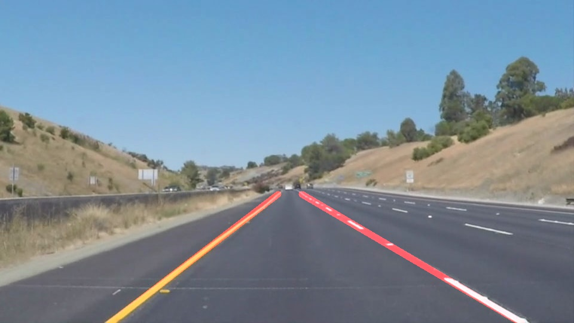

# **Finding Lane Lines on the Road** 
## Overview
When we drive, we use our eyes to decide where to go. The lines on the road that show us where the lanes are act as our constant reference for where to steer the vehicle. Naturally, one of the first things we would like to do in developing a self-driving car is to automatically detect lane lines using an algorithm.

## Requirements
I checked this program on Ubuntu 16.04 64bit.  

- Python 3.x
- Matplotlib
- NumPy
- OpenCV 3.x
- Docker
- Jupyter Notebook

## Setup CarND-Term1-Starter-Kit
### 1. Pull the Precompiled Docker Image from Docker Hub
```shell
$ docker pull udacity/carnd-term1-starter-kit
```

### 2. Clone CarND-LaneLines-P1 Project
```shell
$ git clone https://github.com/atinfinity/CarND-LaneLines-P1.git
```

### 3. Run The Image as a New Container
```shell
$ cd ~/src/CarND-LaneLines-P1
$ docker run -it --rm -p 8888:8888 -v `pwd`:/src udacity/carnd-term1-starter-kit
```

### 4. Open notebook
Plese open `P1.ipynb` from your browser.

## My Pipeline
My pipeline consists of the following processing.

1. Extraction of the Lane Color(white and yellow)
1. Color Conversion(grayscale)
1. Smoothing
1. Edge Detection
1. Region Selection using ROI(Region Of Interest)
1. Hough Transform
1. Post-Processing

## Results(Test images)
### solidWhiteCurve


### solidWhiteRight


### solidYellowCurve


### solidYellowCurve2


### solidYellowLeft


### whiteCarLaneSwitch


## Results(Test Videos)
- [test_videos_output/solidWhiteRight.mp4](https://github.com/atinfinity/CarND-LaneLines-P1/blob/master/test_videos_output/solidWhiteRight.mp4)
- [test_videos_output/solidYellowLeft.mp4](https://github.com/atinfinity/CarND-LaneLines-P1/blob/master/test_videos_output/solidYellowLeft.mp4)
- [test_videos_output/challenge.mp4](https://github.com/atinfinity/CarND-LaneLines-P1/blob/master/test_videos_output/challenge.mp4)

## Experimental material
- [Color Conversion Test](https://github.com/atinfinity/CarND-LaneLines-P1/blob/master/experimental/Color-Conversion-Test.ipynb)

## Reference
- <https://github.com/udacity/CarND-Term1-Starter-Kit>
- <https://github.com/udacity/CarND-LaneLines-P1>
- <https://en.wikipedia.org/wiki/HSL_and_HSV>