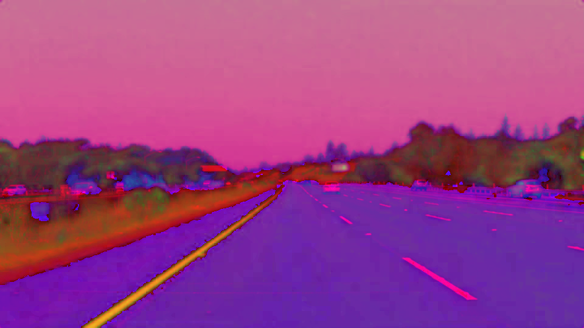
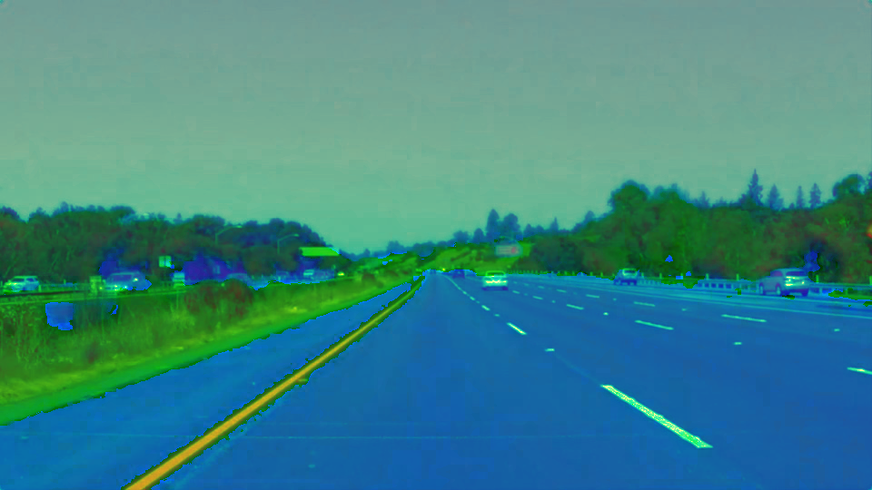
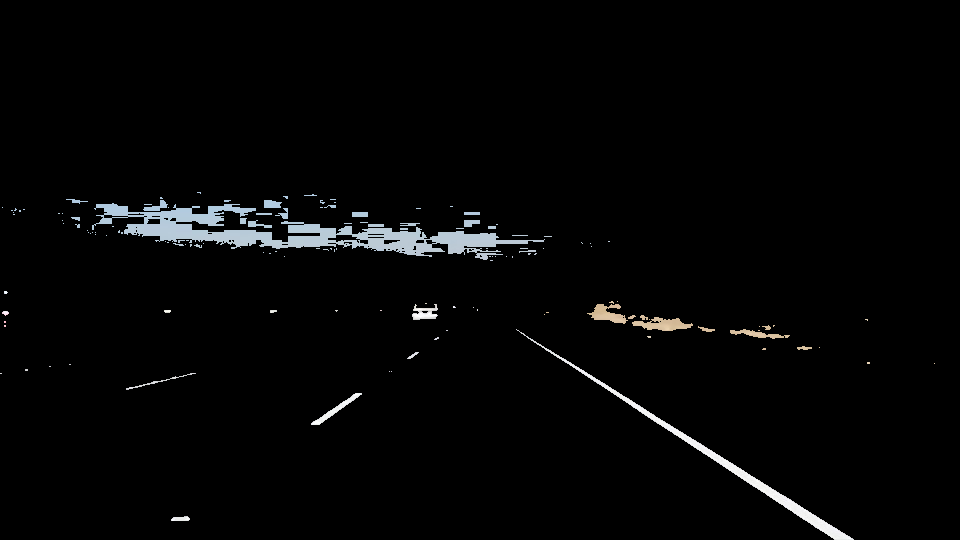
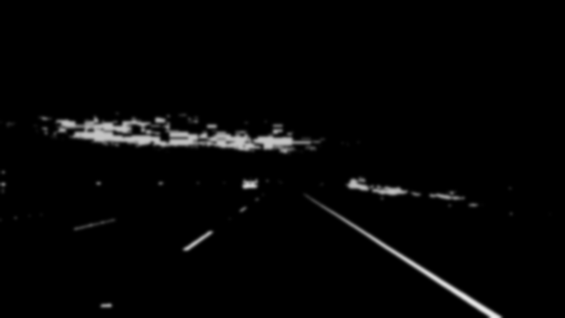
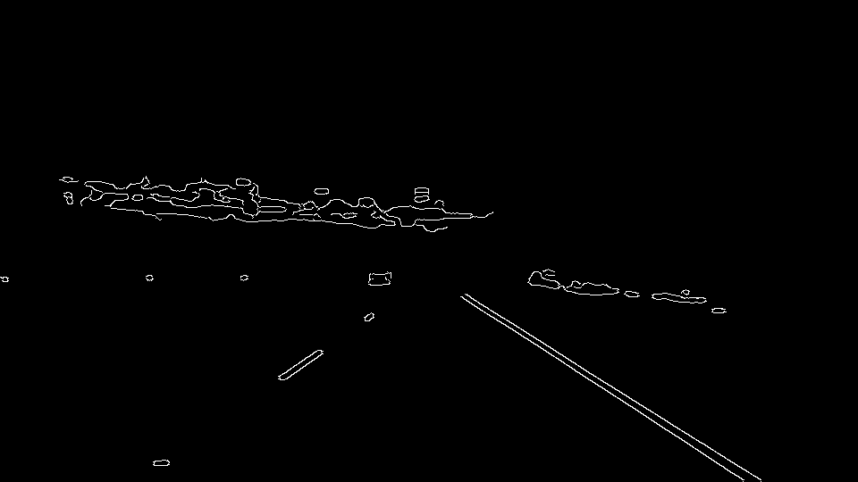
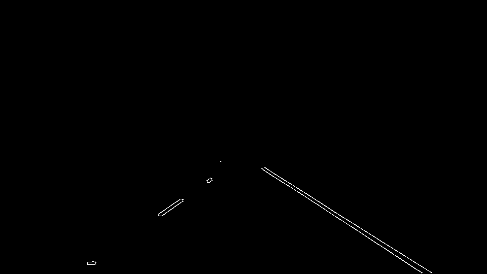
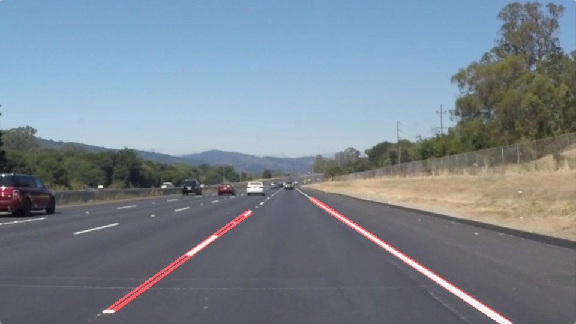

# **Finding Lane Lines on the Road** 


## **Finding Lane Lines on the Road**

The goals / steps of this project are the following:
* Make a pipeline that finds lane lines on the road
* Reflect on your work in a written report

---

## Reflection

### 1. My Pipeline

My pipeline consisted of 5 steps.  

1. Extraction of the Lane Color(white, yellow)
1. Color Conversion(grayscale)
1. Smoothing
1. Edge Detection
1. Region Selection
1. Line Detection
1. Post-Processing

#### Extraction of the Lane Color(white and yellow)
At first, I try to extract the feature of lane to detect lane on road.  
Then, I'm going to focus on the color(white, yellow) of lane.  
However, RGB colorspace isn't suitable for extracting color.  

So, I tried the following colorspace.  

- HSV[3]
- HLS[3]

And, I confirmed which one of HSV and HLS is suitable to extract the color of lane.  
This experiment is written in [experimental/Color-Conversion-Test.ipynb](https://github.com/atinfinity/CarND-LaneLines-P1/blob/master/experimental/Color-Conversion-Test.ipynb)

| | | |
|:--:|:--:|:--:|
| input | HSV | HLS |

As a result, I think that road surface and white lane have similar value on HSV color space.  
From these results, I think that HLS colorspace is suitable to extract the color(white, yellow) of lane.  
And, `Extraction of the Lane Color` has the following processing.

- Color Selection
  - Use `cv2.inRange` to extract the white color and the yellow color seperately.
- Combine white color mask and yellow color mask
  - Use `cv2.bitwise_or` to combine white color mask and yellow color mask.
- Compose combined mask
  - Use `cv2.bitwise_and` to apply the combined mask onto the original RGB image

| | |
|:--:|:--:|
| input | output |

#### Color Conversion
I convert from extracted color image to grayscale for `Edge Detection`.  

```python
def grayscale(img):
    return cv2.cvtColor(img, cv2.COLOR_RGB2GRAY)
```

| | |
|:--:|:--:|
| input | output |

#### Smoothing
I applied `Gaussian Blur` before Edge Detection.  
Because, `Gaussian Blur` has the effect of reducing pepper noise.

```python
def gaussian_blur(img, kernel_size):
    return cv2.GaussianBlur(img, (kernel_size, kernel_size), 0)
```

| | |
|:--:|:--:|
| input | output |

#### Edge Detection
I applied `Canny edge detector`[4][5] to extract the edge of lane.

```python
def canny(img, low_threshold, high_threshold):
    return cv2.Canny(img, low_threshold, high_threshold)
```

| | |
|:--:|:--:|
| input | output |

#### Region Selection using ROI(Region Of Interest)
I assume that the front facing camera that took the image is mounted in a fixed position on the car, it is possible to effectively reduce the search region of lane.

| | |
|:--:|:--:|
| input | output |

#### Hough Transform
I applied `Hough Transform`[7] to extract lines of lane.

```python
def hough_lines(img, rho, theta, threshold, min_line_len, max_line_gap):
    lines = cv2.HoughLinesP(img, rho, theta, threshold, np.array([]), minLineLength=min_line_len, maxLineGap=max_line_gap)
    return lines
```

| | |
|:--:|:--:|
| input | output |

#### Post-Processing
As a result of `Hough Transform`, multiple lines may be detected.    
In this case, we need to extrapolate the line to cover full lane line length.
So, I calculated average slope and intercept for the left and right lanes

| | |
|:--:|:--:|
| input | output |

### 2. Identification of potential shortcomings with my current pipeline

I think that my current pipeline has shortcoming the following case.

#### A. curvy lanes
My current pipeline assumes a lane close to a straight line.  
So, It can be detected by `Hough Transform`.  

But, there is also curvy lanes in the real world.  
I think that `Hough Transform` can not handle in this case.

#### B. change of the setting of camera
I assumed that the front facing camera that took the image is mounted in a fixed position on the car. So, we can select the region fixed ROI. 

But, the position of the camera may move during driving.  
I think that my current pipeline can not handle suitable ROI in this case.

#### C. different lighting conditions
Current test data consists only of daytime and fine weather scenes.  
So, parameters of `Color Selection` are specialized in this case.  
I think that my current pipeline can not handle scene has different lighting conditions.

### 3. Suggestion of possible improvements to my pipeline
I suggest improvements to overcome mentioned shortcomings.

#### A-1
#### B-1
#### C-1

### Experimental material
- [Color Conversion Test](https://github.com/atinfinity/CarND-LaneLines-P1/blob/master/experimental/Color-Conversion-Test.ipynb)

### Reference
- [1] <https://github.com/udacity/CarND-Term1-Starter-Kit>
- [2] <https://github.com/udacity/CarND-LaneLines-P1>
- [3] <https://en.wikipedia.org/wiki/HSL_and_HSV>
- [4] Canny, J., A Computational Approach To Edge Detection, IEEE Trans. Pattern Analysis and Machine Intelligence, 8(6):679–698, 1986.
- [5] <https://en.wikipedia.org/wiki/Canny_edge_detector>
- [6] <https://docs.opencv.org/3.4.1/da/d5c/tutorial_canny_detector.html>
- [7] <https://en.wikipedia.org/wiki/Hough_transform>
- [8] <https://docs.opencv.org/3.4.1/d9/db0/tutorial_hough_lines.html>
- [9] <https://arxiv.org/pdf/1501.03124.pdf>
